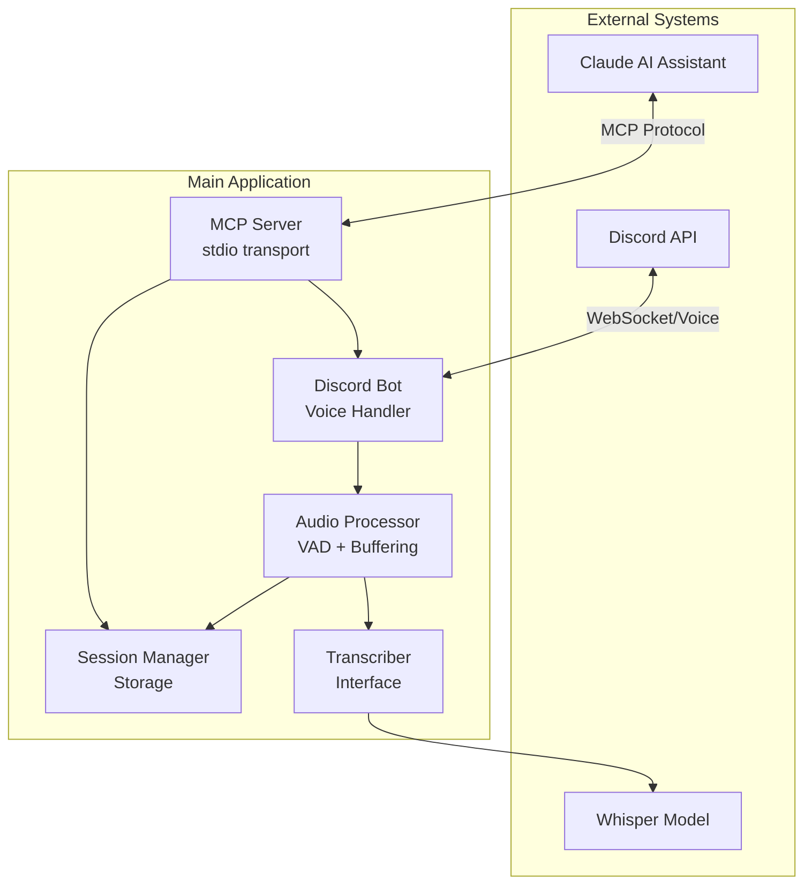
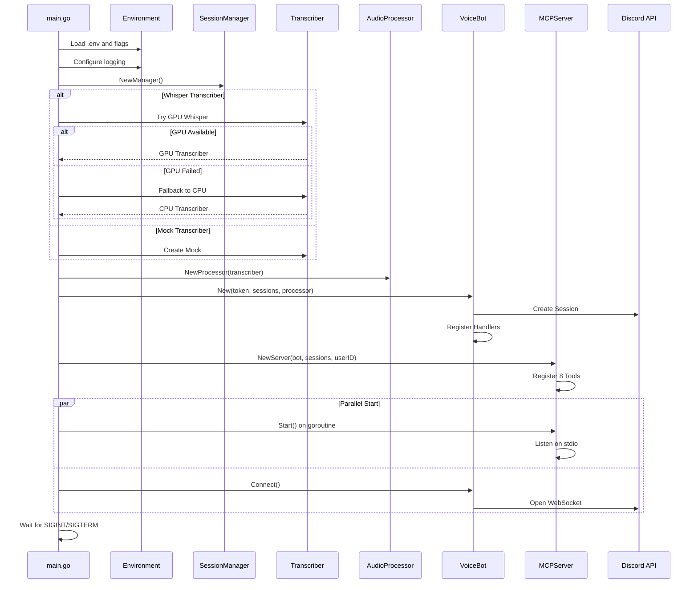
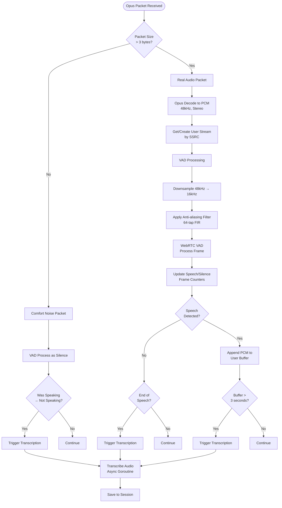
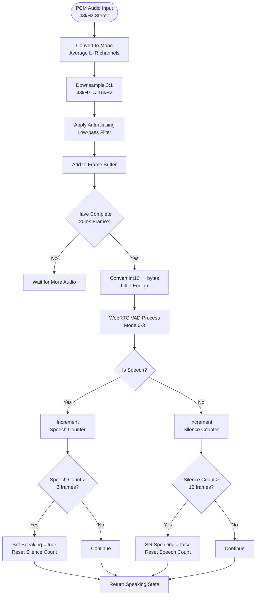
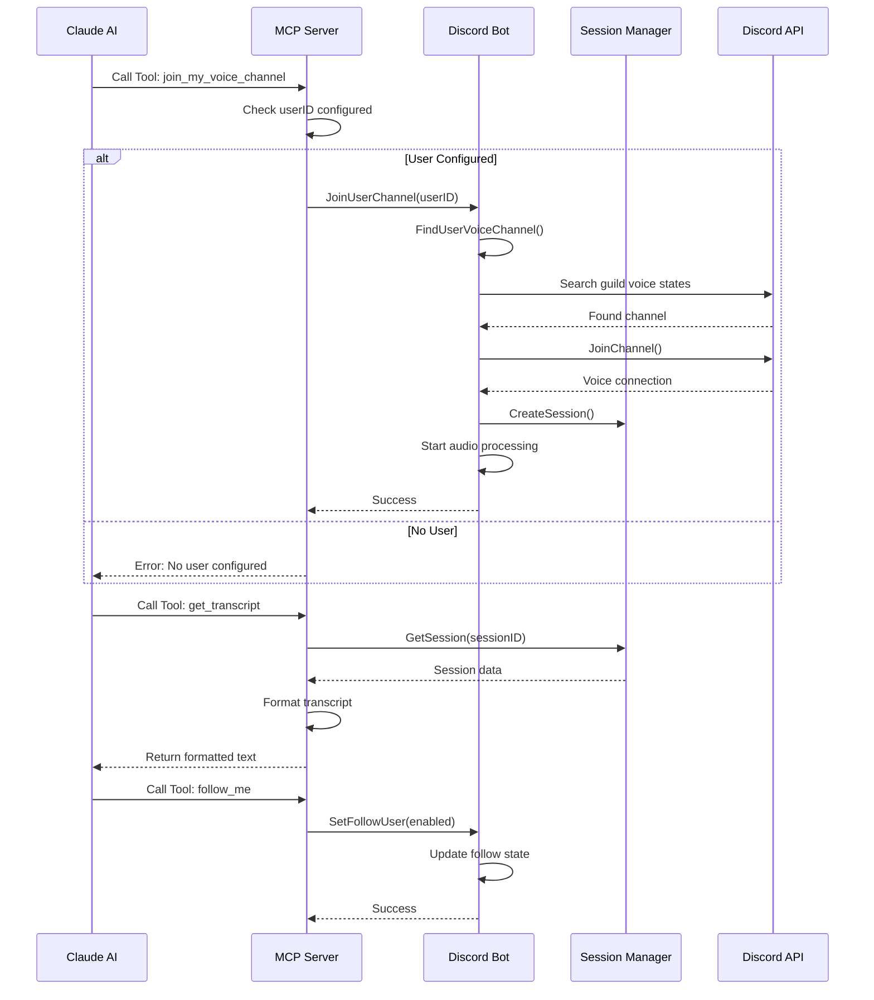

# Discord Voice Transcription System - Complete Architecture Documentation

## Table of Contents
1. [System Overview](#system-overview)
2. [Architecture Flowcharts](#architecture-flowcharts)
3. [Component Deep Dive](#component-deep-dive)
4. [Data Flow Analysis](#data-flow-analysis)
5. [Pros and Cons Analysis](#pros-and-cons-analysis)
6. [Architectural Pain Points](#architectural-pain-points)

## System Overview

The Discord Voice Transcription System is a Go-based application that joins Discord voice channels, captures audio in real-time, performs Voice Activity Detection (VAD), transcribes speech, and exposes the functionality through the Model Context Protocol (MCP) for AI assistant integration.

### High-Level Architecture



## Architecture Flowcharts

### 1. System Initialization Flow



### 2. Voice Channel Join Flow


### 3. Audio Processing Pipeline



### 4. Voice Activity Detection (VAD) Flow



### 5. Transcription Context Management


### 6. MCP Tool Execution Flow



## Component Deep Dive

### 1. Main Entry Point (`cmd/discord-voice-mcp/main.go`)

**Responsibilities:**
- Environment configuration loading
- Component initialization orchestration
- Graceful shutdown handling
- Transcriber selection (Mock/Whisper/GPU)

**Key Features:**
- Supports multiple transcriber backends with fallback
- Context-based shutdown for clean resource cleanup
- Parallel startup of MCP server and Discord connection

### 2. MCP Server (`internal/mcp/server.go`)

**Responsibilities:**
- Expose Discord bot functionality via MCP protocol
- Handle tool registration and execution
- Format responses for AI assistant consumption

**Available Tools:**
1. `join_my_voice_channel` - Join configured user's channel
2. `follow_me` - Auto-follow user between channels
3. `join_specific_channel` - Join by guild/channel ID
4. `leave_voice_channel` - Disconnect from voice
5. `get_transcript` - Retrieve session transcript
6. `list_sessions` - List all sessions
7. `export_session` - Export to JSON file
8. `get_bot_status` - Get connection status

**Design Pattern:** Command pattern with typed handlers using Go generics

### 3. Discord Bot (`internal/bot/bot.go`)

**Responsibilities:**
- Discord WebSocket connection management
- Voice channel join/leave operations
- SSRC to user mapping for speaker identification
- Auto-follow functionality
- Voice state update handling

**Key Data Structures:**
```go
type VoiceBot struct {
    discord        *discordgo.Session
    sessions       *session.Manager
    audioProcessor *audio.Processor
    voiceConn      *discordgo.VoiceConnection
    followUserID   string
    autoFollow     bool
    ssrcToUser     map[uint32]*UserInfo // SSRC mapping
    mu             sync.Mutex
}
```

### 4. Audio Processor (`internal/audio/processor.go`)

**Responsibilities:**
- Opus audio decoding
- Per-user audio buffering
- VAD integration
- Transcription triggering
- Context management for improved accuracy

**Configuration (Environment Variables):**
- `AUDIO_BUFFER_DURATION_SEC` - Buffer size trigger (default: 3s)
- `AUDIO_SILENCE_TIMEOUT_MS` - Silence detection (default: 1500ms)
- `AUDIO_MIN_BUFFER_MS` - Minimum audio before transcription (default: 100ms)
- `AUDIO_CONTEXT_EXPIRATION_SEC` - Context timeout (default: 10s)

**Transcription Triggers:**
1. Buffer reaches 3 seconds
2. VAD detects end of speech (silence after speaking)
3. User stops speaking (comfort noise packets)

### 5. Voice Activity Detection (`internal/audio/vad.go`)

**Technology:** Google WebRTC VAD (C implementation via CGO)

**Features:**
- Real-time speech/silence detection
- 48kHz to 16kHz downsampling with anti-aliasing
- Hysteresis to prevent rapid state changes
- Frame buffering for incomplete audio frames
- Memory pooling for efficiency

**Configuration:**
- `VAD_MODE` - Aggressiveness 0-3 (default: 2)
- `VAD_SPEECH_FRAMES` - Frames to confirm speech (default: 3)
- `VAD_SILENCE_FRAMES` - Frames to confirm silence (default: 15)

### 6. Session Manager (`internal/session/manager.go`)

**Responsibilities:**
- Thread-safe session storage
- Transcript management
- Pending transcription tracking
- JSON export functionality

**Features:**
- UUID-based session identification
- Real-time pending transcription indicators
- Structured data export

### 7. Transcriber Interface (`pkg/transcriber/`)

**Implementations:**
1. **Mock** - Development/testing (returns placeholder text)
2. **Whisper CPU** - Local whisper.cpp binary
3. **Whisper GPU** - CUDA-accelerated transcription
4. **Context Transcriber** - Wrapper adding context support

**Context Management:**
- Previous transcript used as prompt for continuity
- 10-second expiration for context relevance
- Improves accuracy for continuous conversation

## Data Flow Analysis

### Audio Data Flow

1. **Discord → Application:**
   - Opus packets (20ms frames) via WebSocket
   - SSRC identifies speaker
   - Comfort noise packets indicate silence

2. **Opus → PCM:**
   - Decode to 48kHz stereo PCM
   - 960 samples per frame (20ms)
   - 16-bit signed integers

3. **PCM → VAD:**
   - Downsample to 16kHz mono
   - Apply anti-aliasing filter
   - Process 20ms frames

4. **PCM → Buffer:**
   - Per-user buffering
   - Append only when speech detected
   - Clear on transcription

5. **Buffer → Transcriber:**
   - Convert PCM to format required
   - Include context if available
   - Async processing

### Control Flow

1. **MCP Commands → Bot Actions:**
   - Synchronous tool execution
   - Immediate feedback to AI
   - State changes reflected globally

2. **Voice Events → Audio Processing:**
   - Event-driven architecture
   - Goroutine per voice connection
   - Non-blocking audio pipeline

3. **Transcription → Session Storage:**
   - Async transcription tasks
   - Pending state tracking
   - Timestamp preservation

## Pros and Cons Analysis

### Pros

#### 1. Architecture & Design
- ✅ **Clean separation of concerns** - Well-organized package structure
- ✅ **Interface-based design** - Easy to swap transcriber implementations
- ✅ **MCP integration** - Seamless AI assistant control
- ✅ **Modular components** - Each component has single responsibility

#### 2. Performance & Efficiency
- ✅ **Memory pooling** - Efficient buffer reuse in VAD
- ✅ **Concurrent processing** - Non-blocking audio pipeline
- ✅ **GPU acceleration support** - Optional CUDA for transcription
- ✅ **Efficient VAD** - WebRTC VAD is battle-tested and optimized

#### 3. Features
- ✅ **Context-aware transcription** - Better accuracy for conversations
- ✅ **Multi-user support** - SSRC-based speaker identification
- ✅ **Auto-follow capability** - Convenient for single-user scenarios
- ✅ **Real-time processing** - Low-latency transcription
- ✅ **Configurable parameters** - Environment-based configuration

#### 4. Reliability
- ✅ **Graceful shutdown** - Context-based cleanup
- ✅ **Error recovery** - Fallback from GPU to CPU
- ✅ **Thread-safe operations** - Proper mutex usage
- ✅ **Defensive programming** - Nil checks, safe type assertions

### Cons

#### 1. Architectural Issues
- ❌ **Tight coupling** - Audio processor directly knows about sessions
- ❌ **Missing abstraction layer** - No service layer between MCP and bot
- ❌ **Limited extensibility** - Hard to add new audio sources
- ❌ **No event bus** - Components directly call each other

#### 2. Resource Management
- ❌ **Memory growth** - User buffers can grow unbounded
- ❌ **No buffer pooling** - Audio buffers recreated per user
- ❌ **Goroutine leaks** - No cleanup for abandoned streams
- ❌ **Missing metrics** - No resource usage monitoring

#### 3. Error Handling
- ❌ **Silent failures** - Some errors only logged, not propagated
- ❌ **No retry logic** - Failed transcriptions lost
- ❌ **Limited error context** - Errors don't include full context
- ❌ **No circuit breaker** - Can keep trying failed operations

#### 4. Scalability Limitations
- ❌ **Single bot instance** - Can't join multiple channels simultaneously
- ❌ **In-memory sessions** - Sessions lost on restart
- ❌ **No clustering support** - Can't distribute load
- ❌ **Blocking transcription** - One slow transcription affects stream

#### 5. User Experience
- ❌ **No partial transcripts** - Must wait for full buffer
- ❌ **Lost audio on errors** - Buffer cleared even on failure
- ❌ **No speaker diarization** - Can't identify who said what in transcript
- ❌ **Limited feedback** - No progress indicators for long transcriptions

#### 6. Technical Debt
- ❌ **CGO dependency** - Complicates builds and deployment
- ❌ **Missing tests** - Limited test coverage for critical paths
- ❌ **No benchmarks** - Performance characteristics unknown
- ❌ **Incomplete Google transcriber** - Stub implementation

## Architectural Pain Points

### 1. Single Channel Limitation
**Problem:** Bot can only be in one voice channel at a time
**Impact:** Cannot monitor multiple conversations simultaneously
**Solution:** Implement bot pooling or multi-connection architecture

### 2. Memory Management
**Problem:** Unbounded buffer growth for long speeches
**Impact:** Potential OOM for extended recordings
**Solution:** Implement rolling buffers with max size limits

### 3. Synchronous Transcription Blocking
**Problem:** Transcription blocks the audio processing pipeline
**Impact:** Can miss audio packets during transcription
**Solution:** Implement proper producer-consumer pattern with queues

### 4. State Management
**Problem:** State scattered across multiple components
**Impact:** Difficult to track system state, potential inconsistencies
**Solution:** Centralized state management with event sourcing

### 5. Error Recovery
**Problem:** No automatic recovery from transient failures
**Impact:** Manual intervention required for common issues
**Solution:** Implement retry policies and circuit breakers

### 6. Observability
**Problem:** Limited visibility into system behavior
**Impact:** Difficult to debug production issues
**Solution:** Add OpenTelemetry instrumentation

### 7. Testing Challenges
**Problem:** Components tightly coupled, making unit testing difficult
**Impact:** Low confidence in changes, potential regressions
**Solution:** Dependency injection and interface segregation

### 8. Configuration Management
**Problem:** Configuration spread across environment variables
**Impact:** Difficult to validate and manage configurations
**Solution:** Centralized configuration with validation

### 9. Resource Lifecycle
**Problem:** No proper lifecycle management for long-running resources
**Impact:** Resource leaks, zombie goroutines
**Solution:** Implement proper context propagation and cleanup

### 10. Scalability Bottleneck
**Problem:** All processing happens in single process
**Impact:** Cannot scale beyond single machine capabilities
**Solution:** Microservice architecture with message queuing

## Recommendations for Improvement

### Immediate Fixes (High Priority)
1. Add buffer size limits to prevent OOM
2. Implement proper goroutine cleanup
3. Add retry logic for transcription failures
4. Fix resource leaks in audio streams

### Short-term Improvements
1. Add comprehensive error handling
2. Implement metrics collection
3. Add integration tests
4. Create health check endpoints

### Long-term Architectural Changes
1. Implement event-driven architecture
2. Add message queue for audio processing
3. Support multiple simultaneous connections
4. Implement persistent session storage
5. Add horizontal scaling capabilities

## Conclusion

The Discord Voice Transcription System demonstrates good separation of concerns and clean interfaces, but suffers from scalability limitations and resource management issues. The architecture works well for single-channel, moderate-usage scenarios but would require significant refactoring to handle production-scale deployments with multiple simultaneous channels and high availability requirements.

The use of MCP for AI integration is innovative and well-implemented, but the tight coupling between components makes the system brittle and difficult to extend. Moving towards a more event-driven, microservice-oriented architecture would address many of the current limitations while preserving the system's strengths.