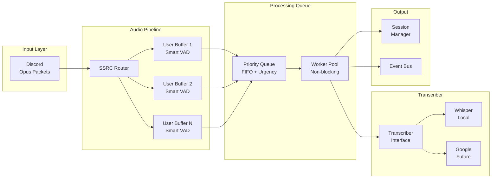

# Pragmatic Redesign: Smart Async Processing with Accurate Transcription

## Core Requirements (What You Actually Need)
1. **Non-blocking processing** - Don't miss audio while transcribing
2. **Speaker attribution** - Know who said what
3. **Reasonable latency** - 2-3 seconds is fine for brainstorming
4. **High accuracy** - Context matters more than speed
5. **Extensible** - Support Whisper now, Google/others later

## The Solution: Smart Async Pipeline (Not Streaming)

Instead of complex streaming, we'll build an intelligent async processing pipeline that maintains accuracy while eliminating blocking.

## Architecture Overview



## Implementation Design

### 1. Smart User Buffers with Intelligent VAD

```go
// Smart buffer that knows when to transcribe
type SmartUserBuffer struct {
    userID      string
    username    string
    ssrc        uint32
    
    // Dual buffer system - one filling, one processing
    activeBuffer   *AudioBuffer
    processingBuffer *AudioBuffer
    
    // Smart VAD - not just silence detection
    vad         *IntelligentVAD
    
    // State tracking
    lastSpeechEnd   time.Time
    lastTranscript  string  // For context
    isProcessing    bool
    
    // Metrics for feedback
    audioReceived   time.Duration
    transcriptCount int
}

type IntelligentVAD struct {
    webrtcVAD      *WebRTCVAD     // Basic speech detection
    energyTracker  *EnergyTracker  // Track energy patterns
    
    // Smart thresholds
    minSpeechDuration  time.Duration // 500ms minimum
    maxSilenceInSpeech time.Duration // 300ms allowed mid-speech
    sentenceEndSilence time.Duration // 800ms for sentence end
    maxSegmentDuration time.Duration // 10 seconds max
}

// Intelligent decision making
func (v *IntelligentVAD) ShouldTranscribe(buffer *AudioBuffer) TranscribeDecision {
    duration := buffer.Duration()
    silenceDuration := time.Since(buffer.LastSpeechTime())
    
    // Reasons to transcribe
    if duration >= 3*time.Second {
        return TranscribeDecision{
            Should: true,
            Reason: "Buffer at comfortable size",
            Priority: Normal,
        }
    }
    
    if silenceDuration > v.sentenceEndSilence && duration > v.minSpeechDuration {
        return TranscribeDecision{
            Should: true,
            Reason: "Natural pause detected",
            Priority: High,
        }
    }
    
    if duration >= v.maxSegmentDuration {
        return TranscribeDecision{
            Should: true,
            Reason: "Maximum duration reached",
            Priority: Urgent,
        }
    }
    
    // Don't transcribe yet
    return TranscribeDecision{Should: false}
}
```

### 2. Non-Blocking Processing Queue

```go
// Non-blocking queue with smart prioritization
type TranscriptionQueue struct {
    segments    chan *AudioSegment
    workers     []*Worker
    metrics     *QueueMetrics
}

type AudioSegment struct {
    ID          string
    UserID      string
    Username    string
    Audio       []byte
    Duration    time.Duration
    Context     string  // Previous transcript for context
    Priority    Priority
    SubmittedAt time.Time
    
    // Callbacks for progress
    OnStart     func()
    OnProgress  func(partial string)
    OnComplete  func(final string)
    OnError     func(error)
}

type Worker struct {
    id          int
    queue       <-chan *AudioSegment
    transcriber Transcriber
}

func (w *Worker) Run(ctx context.Context) {
    for {
        select {
        case segment := <-w.queue:
            // Non-blocking - don't wait for result
            go w.processSegment(segment)
            
        case <-ctx.Done():
            return
        }
    }
}

func (w *Worker) processSegment(segment *AudioSegment) {
    // Notify start
    if segment.OnStart != nil {
        segment.OnStart()
    }
    
    // Transcribe with context
    result, err := w.transcriber.TranscribeWithContext(
        segment.Audio,
        TranscribeOptions{
            PreviousContext: segment.Context,
            Language: "auto",
            // For Whisper: use prompt parameter
            // For Google: use speechContext
        },
    )
    
    if err != nil {
        if segment.OnError != nil {
            segment.OnError(err)
        }
        return
    }
    
    // Notify completion
    if segment.OnComplete != nil {
        segment.OnComplete(result.Text)
    }
}
```

### 3. Unified Transcriber Interface

```go
// Common interface for all transcribers
type Transcriber interface {
    // Basic transcription
    Transcribe(audio []byte) (*TranscriptResult, error)
    
    // With context for better accuracy
    TranscribeWithContext(audio []byte, opts TranscribeOptions) (*TranscriptResult, error)
    
    // Check if ready
    IsReady() bool
    
    // Resource management
    Close() error
}

type TranscribeOptions struct {
    PreviousContext string
    Language        string
    MaxAlternatives int
}

type TranscriptResult struct {
    Text        string
    Confidence  float32
    Words       []Word  // If available
    Language    string
    Duration    time.Duration
}

// Whisper implementation
type WhisperTranscriber struct {
    model       *whisper.Model
    
    // Smart batching for efficiency
    batchQueue  chan *transcribeRequest
    batchSize   int
    batchWait   time.Duration
}

func (w *WhisperTranscriber) TranscribeWithContext(audio []byte, opts TranscribeOptions) (*TranscriptResult, error) {
    params := whisper.Params{
        Language: opts.Language,
        Prompt:   opts.PreviousContext, // Use context as prompt
    }
    
    // Process with Whisper
    result := w.model.Transcribe(audio, params)
    
    return &TranscriptResult{
        Text:       result.Text,
        Confidence: result.Confidence,
        Duration:   result.Duration,
    }, nil
}

// Google implementation (future)
type GoogleTranscriber struct {
    client *speech.Client
}

func (g *GoogleTranscriber) TranscribeWithContext(audio []byte, opts TranscribeOptions) (*TranscriptResult, error) {
    config := &speechpb.RecognitionConfig{
        Encoding:        speechpb.RecognitionConfig_LINEAR16,
        SampleRateHertz: 48000,
        AudioChannelCount: 2,
        LanguageCode:    "en-US",
        // Use speech context for better accuracy
        SpeechContexts: []*speechpb.SpeechContext{{
            Phrases: []string{opts.PreviousContext},
        }},
    }
    
    // Process with Google
    // ...
}
```

### 4. Progress Feedback System

```go
// Event-driven feedback without complexity
type FeedbackSystem struct {
    eventBus *EventBus
    sessions *session.Manager
}

type TranscriptEvent struct {
    Type      EventType
    SessionID string
    UserID    string
    Username  string
    
    // Event-specific data
    Data interface{}
}

// Event types
type ProcessingStarted struct {
    SegmentID   string
    Duration    time.Duration
    QueueDepth  int
}

type ProcessingComplete struct {
    SegmentID   string
    Text        string
    ProcessTime time.Duration
}

type UserSpeaking struct {
    UserID      string
    BufferSize  time.Duration
}

// Simple MCP integration
func (mcp *MCPServer) GetSessionStatus(sessionID string) *SessionStatus {
    status := &SessionStatus{
        ActiveSpeakers: []SpeakerStatus{},
        QueueDepth:     mcp.queue.Depth(),
        Processing:     mcp.queue.ActiveCount(),
    }
    
    // Add each active speaker
    for _, buffer := range mcp.buffers {
        if buffer.HasAudio() {
            status.ActiveSpeakers = append(status.ActiveSpeakers, SpeakerStatus{
                UserID:   buffer.userID,
                Username: buffer.username,
                BufferDuration: buffer.Duration(),
                IsProcessing: buffer.isProcessing,
            })
        }
    }
    
    return status
}
```

### 5. Smart Buffer Swapping (Key Innovation)

```go
// Double buffering prevents audio loss during transcription
func (b *SmartUserBuffer) ProcessAudio(pcm []byte) {
    b.mu.Lock()
    defer b.mu.Unlock()
    
    // Always write to active buffer
    b.activeBuffer.Append(pcm)
    
    // Check if we should transcribe
    decision := b.vad.ShouldTranscribe(b.activeBuffer)
    
    if decision.Should && !b.isProcessing {
        // Swap buffers - instant, no blocking
        b.processingBuffer = b.activeBuffer
        b.activeBuffer = NewAudioBuffer()
        b.isProcessing = true
        
        // Create segment for queue
        segment := &AudioSegment{
            ID:       uuid.New().String(),
            UserID:   b.userID,
            Username: b.username,
            Audio:    b.processingBuffer.GetPCM(),
            Duration: b.processingBuffer.Duration(),
            Context:  b.lastTranscript,
            Priority: decision.Priority,
            
            OnComplete: func(text string) {
                b.mu.Lock()
                b.lastTranscript = text
                b.isProcessing = false
                b.mu.Unlock()
            },
        }
        
        // Non-blocking send to queue
        select {
        case b.queue.segments <- segment:
            // Sent successfully
        default:
            // Queue full, log and drop (shouldn't happen with proper sizing)
            log.Warn("Queue full, dropping segment")
        }
    }
}
```

## Implementation Plan

### Phase 1: Core Async Pipeline (Week 1)
```go
// Start with these files
internal/audio/smart_buffer.go      // Smart dual-buffer system
internal/audio/intelligent_vad.go   // Better VAD logic
internal/pipeline/queue.go          // Non-blocking queue
internal/pipeline/worker.go         // Worker pool
```

### Phase 2: Transcriber Interface (Week 1-2)
```go
// Refactor existing transcribers
pkg/transcriber/interface.go        // Common interface
pkg/transcriber/whisper_async.go    // Async Whisper wrapper
pkg/transcriber/mock_async.go       // For testing
```

### Phase 3: Feedback System (Week 2)
```go
// Add progress tracking
internal/feedback/events.go         // Event bus
internal/feedback/metrics.go        // Performance metrics
internal/mcp/status.go             // Status endpoints
```

### Phase 4: Optimization (Week 2-3)
- Profile and tune buffer sizes
- Optimize VAD thresholds
- Add circuit breakers
- Implement batch processing for Whisper

## Configuration

```yaml
audio:
  # Smart buffering
  buffer_target_sec: 3.0        # Ideal buffer size
  buffer_max_sec: 10.0          # Force transcribe at this size
  min_speech_sec: 0.5           # Minimum before transcribing
  
vad:
  # Intelligent thresholds
  sentence_end_silence_ms: 800  # Natural pause
  mid_speech_silence_ms: 300    # Allowed mid-sentence
  energy_drop_ratio: 0.4        # Energy drop for pause detection

pipeline:
  # Queue settings
  queue_size: 100              # Segments in queue
  worker_count: 2               # Concurrent workers
  
transcriber:
  # Whisper settings
  model_path: "models/base.bin"
  batch_size: 1                # Can batch if needed
  max_context_length: 224      # Whisper prompt limit

feedback:
  # Progress updates
  update_interval_ms: 500      # Status update frequency
```

## Why This Approach Works

### Solves Your Real Problems
1. **Non-blocking** ✓ - Dual buffers, async queue
2. **Speaker attribution** ✓ - Maintained per SSRC
3. **Reasonable latency** ✓ - 2-3 seconds average
4. **High accuracy** ✓ - Full context preserved
5. **Extensible** ✓ - Clean interface for any transcriber

### Avoids Complexity Traps
- No fake streaming that reduces accuracy
- No resource explosion from parallel models  
- No complex correction mechanisms
- No unreliable sentence detection

### Pragmatic Trade-offs
- Latency: 2-3 seconds (acceptable for your use case)
- Simplicity: Much simpler than streaming
- Accuracy: Better with context
- Resources: Single Whisper instance is enough

## Next Steps

1. **Start with smart buffers** - Implement dual-buffer system
2. **Add async queue** - Non-blocking processing
3. **Test with mock** - Validate the pipeline
4. **Integrate Whisper** - With context support
5. **Add feedback** - Simple progress events

This is what I would build. It's pragmatic, achievable, and solves your actual problems without the streaming complexity that would hurt accuracy and reliability.