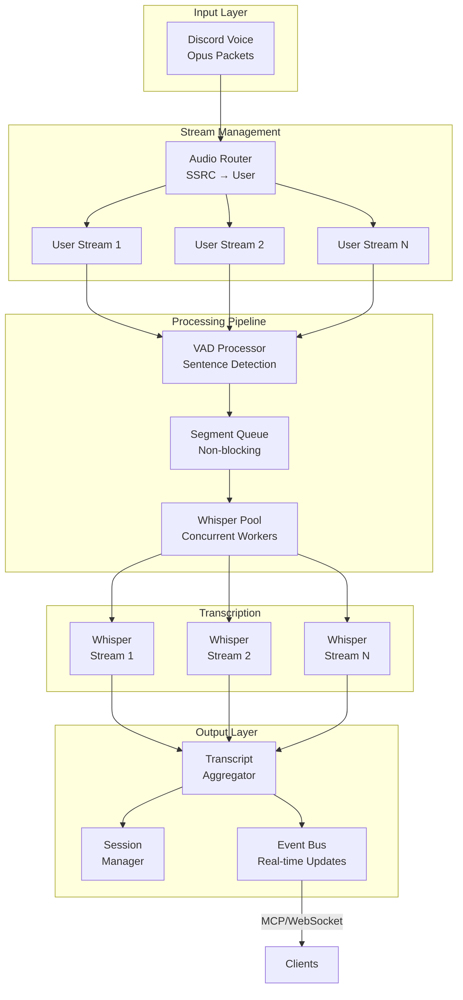
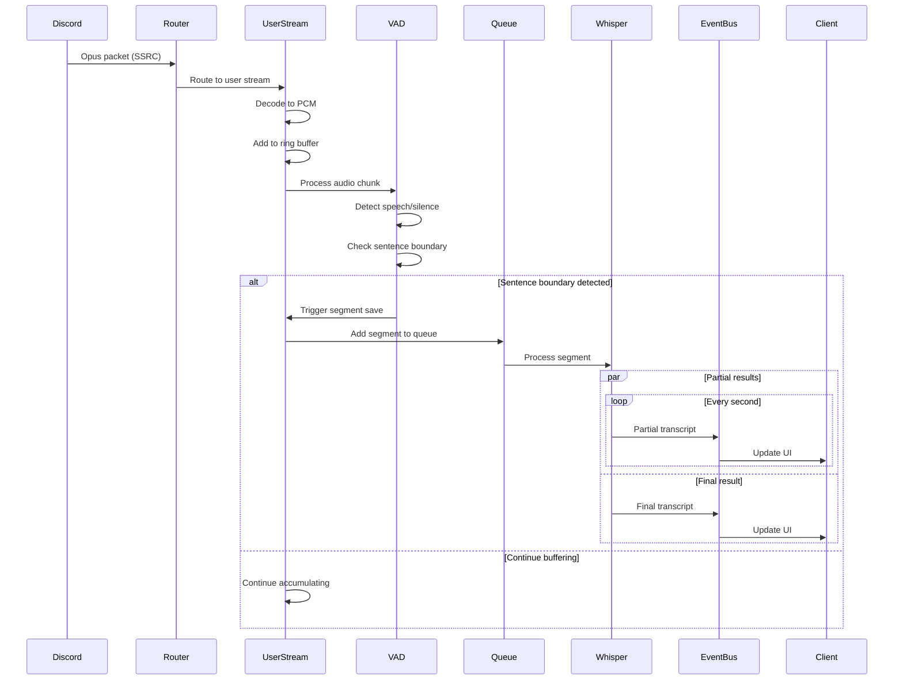
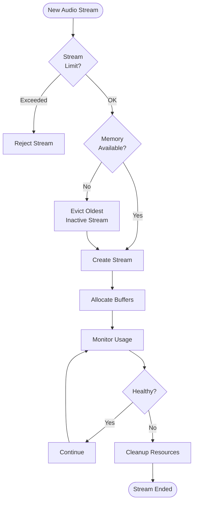

# Discord Voice Transcription System - Streaming Redesign Plan

## Executive Summary

This document outlines a comprehensive redesign of the Discord voice transcription system to support real-time streaming transcription with per-user audio streams, continuous VAD processing, and partial transcript support. The redesign addresses critical limitations in the current architecture while maintaining the existing MCP interface.

## Goals & Requirements

### Primary Goals
1. **Streaming Transcription** - Real-time transcription through Whisper streaming API
2. **Per-User Streams** - Independent audio stream for each speaking user
3. **Smart Segmentation** - VAD-based sentence/phrase boundary detection
4. **Non-Blocking Pipeline** - Concurrent processing without bottlenecks
5. **Real-Time Feedback** - Partial transcripts and progress indicators

### Addressed Issues
- ✅ Blocking transcription bottleneck
- ✅ No partial transcripts limitation
- ✅ Speaker diarization (who said what)
- ✅ Limited feedback for long transcriptions
- ✅ Memory management issues
- ✅ Resource lifecycle problems

## Architecture Redesign

### High-Level Architecture



### Component Design

## 1. Audio Router & Stream Manager

```go
// New stream manager with per-user isolation
type StreamManager struct {
    mu         sync.RWMutex
    streams    map[uint32]*UserAudioStream // SSRC → Stream
    router     *AudioRouter
    vadPool    *VADProcessorPool
    eventBus   *EventBus
}

type UserAudioStream struct {
    UserID          string
    Username        string
    SSRC            uint32
    
    // Ring buffer for continuous audio
    audioRing       *RingBuffer
    
    // VAD state
    vadState        *VADState
    lastSpeechEnd   time.Time
    
    // Streaming transcription
    whisperStream   *WhisperStream
    currentSegment  *AudioSegment
    
    // Metrics
    metrics         *StreamMetrics
}

type AudioSegment struct {
    ID              string
    UserID          string
    StartTime       time.Time
    EndTime         time.Time
    AudioData       []byte
    
    // Partial results
    PartialText     string
    FinalText       string
    Confidence      float32
    
    // State
    Status          SegmentStatus // pending, processing, completed
}
```

## 2. Enhanced VAD with Sentence Detection

```go
// Advanced VAD with sentence boundary detection
type VADProcessor struct {
    // WebRTC VAD for speech detection
    webrtcVAD       *WebRTCVAD
    
    // Silero VAD for better accuracy (optional)
    sileroVAD       *SileroVAD
    
    // Sentence boundary detection
    energyAnalyzer  *EnergyAnalyzer
    pauseDetector   *PauseDetector
    
    // Configuration
    config          VADConfig
}

type VADConfig struct {
    // Speech detection
    SpeechThreshold    float32
    MinSpeechDuration  time.Duration
    
    // Sentence boundaries
    MinPauseDuration   time.Duration  // 300ms for comma, 500ms for period
    MaxSegmentDuration time.Duration  // 30 seconds max
    
    // Energy-based detection
    EnergyDropRatio    float32        // 0.3 = 30% drop indicates pause
}

type VADState struct {
    IsSpeaking         bool
    SpeechStart        time.Time
    LastSpeechFrame    time.Time
    
    // Sentence detection
    PotentialBoundary  bool
    BoundaryConfidence float32
    
    // Buffer for lookahead
    LookaheadBuffer    []int16
}

// Process audio with sentence boundary detection
func (v *VADProcessor) ProcessAudioStream(audio []int16, state *VADState) VADResult {
    // 1. Basic speech detection
    isSpeech := v.webrtcVAD.IsSpeech(audio)
    
    // 2. Energy analysis for pause detection
    energy := v.energyAnalyzer.Calculate(audio)
    isPause := v.pauseDetector.DetectPause(energy, state)
    
    // 3. Sentence boundary detection
    if state.IsSpeaking && isPause {
        pauseDuration := time.Since(state.LastSpeechFrame)
        
        if pauseDuration > v.config.MinPauseDuration {
            // Potential sentence boundary
            return VADResult{
                IsSpeech:          false,
                SegmentBoundary:   true,
                BoundaryType:      detectBoundaryType(pauseDuration),
                Confidence:        calculateConfidence(energy, pauseDuration),
            }
        }
    }
    
    // 4. Maximum segment duration check
    if state.IsSpeaking {
        duration := time.Since(state.SpeechStart)
        if duration > v.config.MaxSegmentDuration {
            return VADResult{
                IsSpeech:        true,
                SegmentBoundary: true,
                BoundaryType:    BoundaryForceBreak,
            }
        }
    }
    
    return VADResult{
        IsSpeech:        isSpeech,
        SegmentBoundary: false,
    }
}
```

## 3. Whisper Streaming Integration

```go
// Whisper streaming interface
type WhisperStream struct {
    model           *WhisperModel
    
    // Streaming state
    context         *StreamContext
    audioBuffer     *CircularBuffer
    
    // Results channel
    partialResults  chan *TranscriptResult
    finalResults    chan *TranscriptResult
    
    // Control
    cancel          context.CancelFunc
}

type StreamContext struct {
    // Previous segments for context
    previousSegments []*TranscriptResult
    maxContext       int // Keep last N segments
    
    // Language detection
    detectedLanguage string
    languageProb     float32
    
    // Speaker adaptation
    speakerProfile   *SpeakerProfile
}

// Streaming transcription with partial results
func (w *WhisperStream) StreamTranscribe(audioStream <-chan []byte) {
    go func() {
        for audio := range audioStream {
            // Add to rolling buffer
            w.audioBuffer.Append(audio)
            
            // Process with minimum latency (e.g., 1 second chunks)
            if w.audioBuffer.Duration() >= 1.0 {
                chunk := w.audioBuffer.GetChunk(1.0)
                
                // Get partial result
                partial := w.model.TranscribePartial(chunk, w.context)
                select {
                case w.partialResults <- partial:
                case <-time.After(100 * time.Millisecond):
                    // Drop if channel is blocked
                }
            }
        }
    }()
}

// Process sentence boundary - finalize transcription
func (w *WhisperStream) FinalizeSentence(audio []byte) *TranscriptResult {
    // Process with full context and higher accuracy
    result := w.model.TranscribeFinal(audio, w.context)
    
    // Update context for next segment
    w.context.AddSegment(result)
    
    // Update speaker profile
    w.context.speakerProfile.Update(result)
    
    return result
}
```

## 4. Non-Blocking Processing Pipeline

```go
// Segment queue for non-blocking processing
type SegmentQueue struct {
    queue     chan *AudioSegment
    workers   []*TranscriptionWorker
    pool      *WhisperPool
}

type WhisperPool struct {
    models    []*WhisperModel
    available chan *WhisperModel
    
    // Metrics
    inUse     int32
    waiting   int32
}

type TranscriptionWorker struct {
    id        int
    queue     <-chan *AudioSegment
    pool      *WhisperPool
    output    chan<- *TranscriptResult
}

func (w *TranscriptionWorker) Run(ctx context.Context) {
    for {
        select {
        case segment := <-w.queue:
            // Get available model from pool
            model := w.pool.Get()
            
            // Process segment
            result := w.processSegment(segment, model)
            
            // Return model to pool
            w.pool.Release(model)
            
            // Send result
            select {
            case w.output <- result:
            case <-ctx.Done():
                return
            }
            
        case <-ctx.Done():
            return
        }
    }
}
```

## 5. Event-Driven Updates

```go
// Event bus for real-time updates
type EventBus struct {
    subscribers map[string][]EventHandler
    mu          sync.RWMutex
}

type TranscriptEvent struct {
    Type        EventType // partial, final, correction
    SessionID   string
    UserID      string
    SegmentID   string
    Text        string
    Timestamp   time.Time
    Confidence  float32
}

// Event types
const (
    EventPartialTranscript EventType = "partial"
    EventFinalTranscript   EventType = "final"
    EventCorrection        EventType = "correction"
    EventSpeakerChange     EventType = "speaker_change"
    EventProcessingStart   EventType = "processing_start"
    EventProcessingEnd     EventType = "processing_end"
)

// MCP integration for real-time updates
func (s *MCPServer) StreamTranscriptUpdates(sessionID string) (<-chan *TranscriptEvent, func()) {
    events := make(chan *TranscriptEvent, 100)
    
    handler := func(event *TranscriptEvent) {
        if event.SessionID == sessionID {
            select {
            case events <- event:
            default:
                // Drop if channel is full
            }
        }
    }
    
    s.eventBus.Subscribe("transcript.*", handler)
    
    cleanup := func() {
        s.eventBus.Unsubscribe(handler)
        close(events)
    }
    
    return events, cleanup
}
```

## 6. Memory Management & Resource Control

```go
// Ring buffer for efficient memory usage
type RingBuffer struct {
    data      []byte
    capacity  int
    writePos  int
    readPos   int
    mu        sync.Mutex
}

// Implement circular buffer logic
func (r *RingBuffer) Write(data []byte) {
    r.mu.Lock()
    defer r.mu.Unlock()
    
    // Overwrite old data if buffer is full
    for i := 0; i < len(data); i++ {
        r.data[r.writePos] = data[i]
        r.writePos = (r.writePos + 1) % r.capacity
        
        // Move read position if we're overwriting
        if r.writePos == r.readPos {
            r.readPos = (r.readPos + 1) % r.capacity
        }
    }
}

// Resource manager with limits
type ResourceManager struct {
    maxStreams          int
    maxBufferPerStream  int
    maxWhisperInstances int
    
    activeStreams       sync.Map
    memoryUsage        int64
}

func (rm *ResourceManager) CanCreateStream() bool {
    count := 0
    rm.activeStreams.Range(func(_, _ interface{}) bool {
        count++
        return count < rm.maxStreams
    })
    return count < rm.maxStreams
}
```

## Implementation Phases

### Phase 1: Foundation (Week 1-2)
1. **Refactor audio pipeline**
   - Implement per-user stream separation
   - Create ring buffer for continuous audio
   - Add resource manager with limits

2. **Upgrade VAD system**
   - Integrate enhanced VAD with sentence detection
   - Implement pause detection and energy analysis
   - Add configurable boundary detection

### Phase 2: Streaming Core (Week 2-3)
1. **Whisper streaming integration**
   - Implement WhisperStream wrapper
   - Add partial result support
   - Create context management

2. **Non-blocking pipeline**
   - Implement segment queue
   - Create worker pool
   - Add concurrent processing

### Phase 3: Real-time Features (Week 3-4)
1. **Event system**
   - Implement event bus
   - Add MCP streaming support
   - Create WebSocket endpoint (optional)

2. **Feedback mechanisms**
   - Add progress indicators
   - Implement partial transcript updates
   - Create correction/update system

### Phase 4: Optimization (Week 4-5)
1. **Performance tuning**
   - Profile and optimize VAD
   - Tune buffer sizes
   - Optimize memory usage

2. **Testing & reliability**
   - Add comprehensive tests
   - Implement error recovery
   - Add monitoring/metrics

## Technical Requirements

### Dependencies to Add
```toml
# Streaming Whisper support
github.com/ggerganov/whisper.cpp/bindings/go v1.5.0

# Enhanced VAD (optional)
github.com/snakers4/silero-vad-go v1.0.0

# Event bus
github.com/asaskevich/EventBus v0.0.0

# Metrics
github.com/prometheus/client_golang v1.17.0

# Circuit breaker
github.com/sony/gobreaker v0.5.0
```

### Configuration Changes
```yaml
# New configuration structure
audio:
  buffer_size_ms: 100      # Smaller for lower latency
  ring_buffer_size_sec: 30 # 30 seconds rolling buffer

vad:
  model: "webrtc"          # or "silero" for better accuracy
  min_speech_ms: 250
  min_pause_ms: 300        # Comma pause
  sentence_pause_ms: 500   # Period pause
  max_segment_sec: 30

whisper:
  model_path: "models/ggml-base.en.bin"
  stream_enabled: true
  partial_interval_ms: 1000
  max_context_segments: 5
  language: "auto"         # or specific language

pipeline:
  max_concurrent_streams: 10
  worker_pool_size: 4
  queue_size: 100
  max_memory_per_stream_mb: 50
```

## Migration Strategy

### Step 1: Parallel Implementation
- Build new streaming pipeline alongside existing code
- Use feature flag to switch between implementations
- Test with subset of users

### Step 2: Gradual Rollout
- Start with single-user sessions
- Monitor metrics and performance
- Gradually increase usage

### Step 3: Full Migration
- Switch all traffic to new pipeline
- Remove old implementation
- Document new architecture

## Success Metrics

### Performance Metrics
- **Latency**: < 2 seconds for partial transcripts
- **Throughput**: Support 10+ concurrent speakers
- **Memory**: < 50MB per active stream
- **CPU**: < 20% per active stream

### Quality Metrics
- **Accuracy**: > 95% for clear speech
- **Speaker separation**: 100% correct attribution
- **Boundary detection**: > 90% correct sentence breaks

### User Experience
- **Partial updates**: Every 1-2 seconds during speech
- **Final transcripts**: Within 500ms of sentence end
- **Progress indication**: Continuous during processing

## Risk Mitigation

### Technical Risks
1. **Whisper streaming limitations**
   - Mitigation: Implement chunked processing as fallback
   - Alternative: Use cloud API (AssemblyAI, Deepgram)

2. **Memory growth**
   - Mitigation: Strict buffer limits and monitoring
   - Alternative: Disk-based buffering for long sessions

3. **VAD accuracy**
   - Mitigation: Combine multiple VAD models
   - Alternative: User-configurable sensitivity

### Operational Risks
1. **Increased complexity**
   - Mitigation: Comprehensive logging and monitoring
   - Documentation and training

2. **Resource consumption**
   - Mitigation: Auto-scaling and resource limits
   - Circuit breakers for overload protection

## Appendix: Detailed Flows

### A. Audio Processing Flow



### B. Resource Management Flow



## Conclusion

This redesign addresses all the identified pain points while maintaining compatibility with the existing MCP interface. The streaming architecture provides real-time feedback, proper speaker separation, and non-blocking processing. The phased implementation approach allows for gradual migration with minimal risk.

Key improvements:
- ✅ Real-time streaming with partial results
- ✅ Per-user audio streams with speaker identification  
- ✅ Smart sentence boundary detection
- ✅ Non-blocking concurrent processing
- ✅ Proper resource management
- ✅ Event-driven architecture for real-time updates

The system will be more scalable, responsive, and maintainable while providing a significantly better user experience.